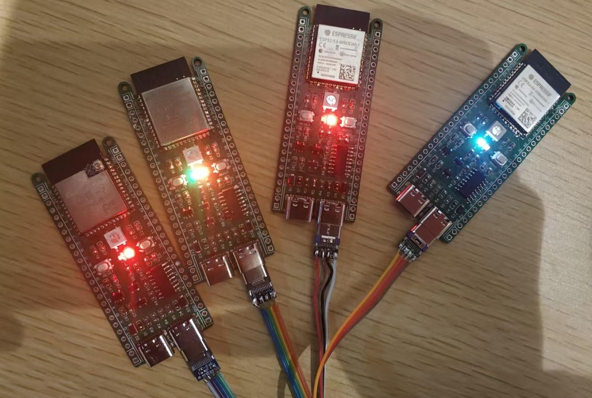

# MINNA

<p align="center">
  
  <br>
  <em style="color: #9b59b6; font-weight: bold;">"I gonna walk with you"</em>
</p>

## 项目简介
MINNA 是一个基于 NodeJS 和 Layui 框架打造的智能物联网系统。它不仅仅是一个管理平台，更是由数字形象 Minna 陪伴的智能助手。系统支持 ESP32 设备接入，并能与抖音扣子平台完美对接，为用户提供流畅的语音对话体验。

本项目正式发布于2025年1月29日（大年初一），代码已经完整测试可运行，支持最新源码编译的xiaozhi固件，项目文档还在完善。

## 📸



## ✨ 特色功能
- 🤖 ESP32 语音对话助手设备接入与管理
- 🎯 多平台AI对接支持：
  - 抖音扣子平台
  - 百度千帆平台
  - 阿里通义千问
- 🗣️ AI智能语音选择，支持45个特色语音
- 🏠 支持本地化部署（tts和大模型需要调用互联网平台，本地模型支持还需要继续开发）
- 🔒 私密性保障（待完全本地升级）
- 🎨 清新优雅的界面设计
- 👧 Minna数字助手陪伴

## 🔨 技术框架
- 后端：Node.js 20.18.1
- 前端：基于 Layui 框架开发
  - 使用 Layui 的免费开源组件
  - 专注于 Layui 核心功能
  - 简洁高效的模块化设计
- 数据库：MongoDB
  - 推荐版本：3.2 或 4.0
  - 更高版本可能需要额外测试验证

## 🚀 快速开始

### 环境要求
- Node.js = 20.18.1
- NPM >= 10.0.0
- Visual Studio Express 2022（C++ 开发工具）
- MongoDB 3.2 或 4.0
- 以管理员权限安装时启动NodeJS CMD

### 前置安装
1. 安装 Visual Studio Express 2022
   - 下载并安装 [Visual Studio Express 2022](https://visualstudio.microsoft.com/vs/express/)
   - 在安装时选择 "使用C++的桌面开发" 
   - 完成安装后重启电脑

2. 安装 MongoDB
   - 下载 [MongoDB 3.2](https://www.mongodb.com/download-center/community/releases/archive) 或 [MongoDB 4.0](https://www.mongodb.com/download-center/community/releases/archive)
   - 按照官方指南完成安装
   - 启动 MongoDB 服务
   - 验证安装：
     ```bash
     mongo --version  # 检查 MongoDB 版本
     ```

3. 安装 Node.js
   - 下载 [Node.js 20.18.1](https://nodejs.org/)
   - **以管理员身份运行**安装程序
   - 确保 Node.js 和 npm 已正确安装：
     ```bash
     node --version  # 应显示 v20.18.1
     npm --version   # 检查 npm 版本
     ```

### 项目安装步骤
1. 克隆项目
  - bash
  - git clone https://gitee.com/manykit/minna.git
  - cd minna/

2 .Windows: 以管理员身份运行 PowerShell 或命令提示符
  - npm install

3 .修改minna/plugins/device-aitalk/.env，Minna/plugins/tts/.env文件，填写抖音扣子，千帆，通义千问的API密钥
  
    COZE_API_TOKEN=

    COZE_BOT_ID=

    QIANFAN_API_ID=
    
    QIANFAN_API_KEY=

    DASHSCOPE_TOKEN=
    
    DASHSCOPE_MODEL_NAME=

    BYTEDANCE_TTS_APP_ID=

    BYTEDANCE_TTS_APP_KEY=
  
4. 修改D:/Minna/dbstart/mongodb3.2.bat内容路径，并执行修改D:/Minna/dbstart/mongostage3.2内容路径，并执行；打开db.txt，查看内容，复制到mongostage3.2命令行框内，执行初始化数据库工作。

执行完毕后，关闭所有命令行。

5. 进入Minna主目录，修改startminna.bat，D:/Minna/dbstart/mongodb3.2auth.bat内路径，并执行；

  - 打开网页http://127.0.0.1:6700


## 📚 主要模块

### 设备管理（AITalk）
- ESP32设备接入
- 设备状态监控
- 远程控制功能

### 智能对话（AIRobot）
- 支持多个AI平台：
  - 抖音扣子
  - 百度千帆
  - 阿里通义千问
- 智能语音交互
- 自然语言处理
- 多场景对话支持

### 语音合成（TTS）
- 多音色支持
- 实时语音合成
- 自定义语音库

## ⚠️ 版权说明
本项目是一个独立开发的系统，前端界面基于 Layui 框架进行开发。为了确保合规性：
- 移除了 LayuiAdmin 相关的专有代码和组件
- 仅使用 Layui 开源框架的功能
- 保留了必要的基础架构，专注于物联网功能实现

### 相关技术版权
- Layui：MIT License
- Node.js：MIT License
- MongoDB：Server Side Public License (SSPL)

## 📝 特别说明
如果您计划在商业项目中使用 LayuiAdmin 的功能，请购买其商业授权。

本项目的语音对话功能受到 [xiaozhi](https://github.com/78/xiaozhi) 项目的启发，在其基础上进行了完善，使其能够与小智开源固件进行正常通信。感谢xiaozhi项目团队的开源贡献。

## 📄 开源协议
本项目采用 [MIT](LICENSE) 协议开源。用户基于本项目开发的插件可以选择不开源，并可以进行商业化运营。这意味着您可以：
- 自由使用、修改和分发本项目的代码
- 基于本项目开发的插件可以闭源
- 将您开发的插件用于商业目的
- 在遵守 MIT 协议的前提下，按照您的意愿处理衍生作品

## 🌟 关于 Minna
Minna 是本系统的数字形象，一位充满活力的小女孩。她不仅代表着系统的温暖与智慧，更承载着我们对技术人性化的追求。通过 Minna，我们希望让物联网设备管理变得更加友好和有趣。

## 📞 联系我们
- 官方网站：[https://manykit.com](https://manykit.com)
- 技术支持：manyxu@foxmail.com
- 项目地址：[GitHub Repository](https://gitee.com/manykit/minna)

## 🙏 致谢
 - https://github.com/78/xiaozhi-esp32
 - https://github.com/78/xiaozhi
 - https://gitee.com/layui/layui


### 常见问题
1. 如果在安装依赖时遇到 node-gyp 相关错误，请确保：
   - Visual Studio Express 2022 已正确安装
   - 已安装 C++ 开发工具
   - 使用管理员权限运行安装命令

2. 如果遇到权限相关错误，请确保使用管理员权限运行命令

3. MongoDB 相关问题：
   - 如果使用高于 4.0 版本的 MongoDB，请先在测试环境验证兼容性
   - 确保 MongoDB 服务已经启动
   - 检查数据库连接配置是否正确
